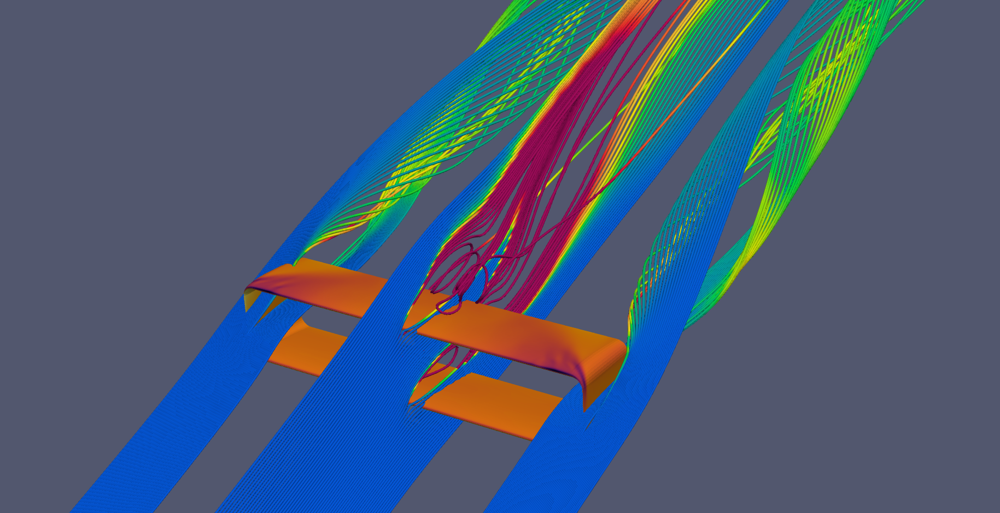

# aerABox (3D box wing aerodynamic design tool)
aerABox is a framework implemented in Matlab for the design, low and high fidelity aerodynamic simulations on box-wings for Airborne Wind Energy Systems. It was developed for the educational research project of Gabriel Buendía, supervised by TU Delft. The ultimate goal of this work is the generation of reliable simulations to study the aerodynamics of box wing design concepts applied to AWE systems. The MATLAB framework includes:
1. Parametrization of the box-wing geometry
2. Box-wing meshing for panel method
3. Aerodynamic simulation using panel method
4. Box-wing meshing for CFD
5. CFD pre-processing and setup 
6. Auxiliar functions to perform the CFD simulations and monitor the residuals

## Prerequisites
1. Install Matlab/Simulink R2021B or later -> For parametization and interface (Mandatory)
2. Install Apame v140915 or later -> For automated panel method meshing and simulation*
3. Install Pointwise V18.5R2 or later -> For automated CFD meshing*
4. Install OpenFOAM v2006 -> For launching simulations manualy*

*Optional -> They are required depending on the type of simulations that are going to be performed
## Main blocks
1. ParametrizationBWFiniteTE.m -> Generates the box-wing geometry in MATLAB and stores all its points in a matrix
2. BoxWingAPAME.m -> Generates the input file for APAME including both the mesh and the aerodynamic simulation parameters
3. BoxWingGlyph.m -> Generates the script that is read by Pointwise for the CFD mesh generation
## Example scripts 
1. automateAPAME.m -> Creates a mesh resolution study for APAME (Prerequisites 1 & 2 needed)
2. BoxWingPointwise -> Creates a CFD mesh for a in Pointwise and automatically exports it to OpenFOAM polyMesh folder (Prerequisites 1 & 3 needed)
3. equivalentAPAME.m -> Creates a sweep on different parameters for APAME (Prerequisites 1 & 2 needed)
4. openFoamConfiguration.m -> (Only for TU Delft cluster users) Creates the folder with all the files needed to launch an OpenFOAM simulation in the cluster (Prerequisites 1 & 4 needed)
5. Sweep_b.m -> Creates APAME simulations sweeping on the wingspan (Prerequisites 1 & 2 needed)
6. Sweep_Check.m -> Checks if the combinations are within the weight and reference surface limits before using equivalentAPAME.m
7. Sweep_h_bs_c.m ->  Creates APAME simulations sweeping on the height to span and stagger to chord ratio (Prerequisites 1 & 2 needed)
8. Sweep_taper_area_l.m -> Creates APAME simulations sweeping on the taper ratio to span and fore wing area to total area ratio (Prerequisites 1 & 2 needed)
## Workspace files
1. data_APAME_spanwise.mat -> Example data for visualization of results of automateAPAME.m
2. EquivalentWingMEGAWESAirfoilFinal1.mat -> Example data for visualization of results of equivalentAPAME.m
3. EquivalentWingMEGAWESAirfoilFinal2.mat -> Example data for visualization of results of equivalentAPAME.m
4. EquivalentWingMEGAWESSweepb.mat -> Example data for visualization of results of Sweep_b.m
5. EquivalentWingMEGAWESSweeph_bs_c.mat -> Example data for visualization of results of Sweep_h_bs_c.m
6. EquivalentWingMEGAWESSweepTaperAreaLow.mat -> Example data for visualization of results of Sweep_taper_area_l.m
7. Flight_Conditions.mat -> Example of the flight conditions used in several functions
8. MEGAWESAirfoil.mat -> Example of a highly cambered airfoil profile taken from Eijkelhof [[1]](#References)
9. MEGAWESData.mat -> Aerodynamic characteristics taken from Eijkelhof [[1]](#References)
10. SweepBounded1.mat -> Example data for visualization of results of Sweep_Check.m
11. SweepBounded2.mat -> Example data for visualization of results of Sweep_Check.m
12. Validation_Data.mat -> Aerodynamic experimental data of a box-wing taken from Gall & Smith [[2]](#References)
## Folders
1. EXAMPLE -> Contains the files used for the automatic generation of the OpenFOAM setup
2. sr_bwa -> Contains the functions used in the BoxWingAPAME.m block
3. sr_bwg -> Contains the functions used in the BoxWingGlyph.m block  
 3.1. sr_aux -> Auxiliar functions used in the BoxWingGlyph.m block  
 3.2. sr_pw -> Pointwise functions the BoxWingGlyph.m block -> These functions can be used to generate any kind of geometry
4. sr_bwp -> Contains the functions used in the ParametrizationBWFiniteTE.m block
5. sr_of -> Contains the functions used in the openFoamConfiguration.m example script
## Recommendations
1. If your geometry is a box-wing, use the main blocks and some example scripts to build your own main script
2. If your geometry is different than a box-wing, use the functions in the folders to build your own main script
3. If you are interested in automatic Pointwise meshing, use the functions of the folder sr_pw to build your own main script 
## References
[1] D. Eijkelhof: Design and Optimisation Framework of a Multi-MW Airborne Wind Energy Reference System. MSc Thesis Delft University of Technoly and Technical University of Denmark, 2019. [uuid:e759f9ad-ab67-43b3-97e0-75558ecf222d](http://resolver.tudelft.nl/uuid:e759f9ad-ab67-43b3-97e0-75558ecf222d)

[2] P. D. Gall and H. C. Smith, “Aerodynamic characteristics of biplanes with winglets,” Journal of Aircraft,
vol. 24, no. 8, pp. 518–522, 1987. DOI: [10.2514/3.45470](https://arc.aiaa.org/doi/10.2514/3.45470)
